# MASTER PRODUCT REQUIREMENTS DOCUMENT (PRD)

**Project:** HomeReady AI — Real Estate Whole-House Upgrade Recommendation Engine  
**Document Version:** 1.0  
**Status:** Production-Ready Blueprint  
**Author:** Senior Product Architect & Full-Stack Engineering  
**Classification:** Confidential / Proprietary  

---

## 1.1 EXECUTIVE SUMMARY

### Vision Statement
HomeReady AI is an intelligent, AI-powered SaaS platform that empowers real estate professionals, homeowners, and brokerages to identify, visualize, and prioritize the highest-ROI whole-house upgrade opportunities before listing. By combining advanced computer vision, hyper-local market comparables, and a vetted contractor marketplace, HomeReady AI transforms pre-listing preparation into a transparent, data-driven, and highly profitable workflow.

### Problem It Solves & Target Market Size
**The Problem:** Real estate agents and homeowners currently spend 20–40 hours researching upgrade opportunities during pre-listing preparation. They lack a single source of truth that combines property inspection data, market comps, ROI calculations, and contractor availability. Existing solutions (spreadsheets, fragmented broker tools, generic home advisors) fail to account for neighborhood-specific value drivers, leaving sellers overwhelmed and uncertain about where to allocate capital.  
**Target Market Size:** With over 5.5 million existing home sales annually in the United States, the pre-listing renovation, staging, and preparation sector represents a $15B+ market opportunity. HomeReady AI directly addresses the friction in this ecosystem.

### Key Competitive Advantages
1. **Automated Computer Vision Gap Analysis:** Instantly identifies room-specific repair needs, structural decay, and aesthetic deficits against local recently sold comparables.
2. **Predictive ROI Ranking Engine:** Dynamically calculates financial return on specific upgrades using hyper-local MLS data and localized contractor pricing models.
3. **End-to-End Execution Loop:** Seamlessly bridges digital visualization with physical execution via direct API integration with local, vetted contractor marketplaces.
4. **Enterprise White-Labeling & Team Management:** Provides robust brokerage customization, team analytics, admin dashboards, and client co-branding.
5. **Best-in-Class Security & Compliance:** Zero-trust architecture featuring secure Backend-for-Frontend (BFF) patterns, rigorous input/upload validation, and enterprise-grade data protection.

### Revenue Opportunity & Business Model Overview
HomeReady AI operates on a hybrid B2B SaaS and B2C transactional business model designed for rapid scaling and predictable recurring revenue:
- **B2B Solo Agent Subscription:** $200–$500/month for top-producing agents requiring batch analysis, white-label reporting, and CRM lead generation.
- **B2B Enterprise Team Subscription:** $2,000–$5,000/month for real estate team leads and brokerages requiring admin dashboards, team analytics, and API integrations.
- **B2C Transactional Reports:** $50–$100 per report for individual homeowners and For-Sale-By-Owner (FSBO) sellers seeking one-off pre-listing optimization.
- **Marketplace Rev-Share / Lead Generation:** Commission and lead-generation fee structures established with partner contractor networks (e.g., Thumbtack, Angi) for successfully routed project bids.

### 12-Month Strategic Milestones
- **Q1 (Foundation & MVP):** Finalize core computer vision models, deploy the API Gateway, implement secure authentication infrastructure, and launch MVP in 5 initial target metropolitan areas.
- **Q2 (Web Platform & Automation):** Roll out the Next.js 15 web application with automated PDF/HTML report generation and initiate the contractor network pilot program.
- **Q3 (Enterprise Expansion):** Implement team administration portals, advanced brokerage white-labeling, and expand operations to the top 25 US metropolitan statistical areas (MSAs).
- **Q4 (Mobile & Scale):** Launch native mobile applications (iOS/Android), complete SOC2 Type II security compliance audit, and achieve comprehensive market penetration across the top 50 US metros.

---

## 1.2 PRODUCT DEFINITION

### Core Value Propositions
- **For Real Estate Agents:** Saves 20+ hours of manual comparative research per listing, provides objective empirical data to justify pre-listing recommendations to clients, accelerates sales velocity, and secures listing premiums of 5–10%.
- **For Homeowners:** Eliminates uncertainty and contractor-shopping friction by delivering crystal-clear, budget-constrained ROI expectations, professional visual proofs, and direct access to vetted local professionals.
- **For Real Estate Companies:** Offers fully customizable white-label solutions, standardizes listing presentation quality across large teams, provides deep agent performance analytics, and enhances brand authority in the local marketplace.

### Success Metrics (SMART)
- **User Adoption:** Acquire 1,000 active monthly agent users and process 5,000 homeowner transactional reports within 90 days of launch; scale to 15,000 monthly active users within 12 months.
- **Revenue:** Achieve $100k ARR by the end of Q2, scaling to $2.5M ARR by Month 12 through enterprise team subscriptions and contractor marketplace rev-share.
- **Product Quality:** Maintain an AI recommendation accuracy rate of ≥ 92% against actual sold comps, achieve a Net Promoter Score (NPS) ≥ 45 within 6 months, and maintain an automated report generation time of < 30 seconds (p95).
- **Market Penetration:** Capture ≥ 15% of active producing agents across the top 50 US metropolitan areas within 12 months.

---

## 1.3 USER PERSONAS & WORKFLOWS

### User Personas

#### Persona 1: Real Estate Agent (Alice, 42, Top 10% Performer)
- **Goals:** Close deals faster, increase listing premiums by 5–10%, win more listing presentations.
- **Pain Points:** Time-intensive pre-listing prep, lack of objective data to justify renovation recommendations to stubborn sellers.
- **Feature Priorities:** Batch property analysis, fully customizable white-label reports, CRM lead generation integration.
- **Willingness to Pay:** $200–$500/month.

#### Persona 2: Homeowner (Bob, 35, Selling for First Time)
- **Goals:** Maximize home sale price, understand concrete ROI before investing capital in repairs.
- **Pain Points:** Overwhelmed by renovation choices, stressful contractor shopping, fear of overcapitalizing.
- **Feature Priorities:** Clear ROI breakdown, professional easy-to-read reports, direct connection to vetted contractor network.
- **Willingness to Pay:** $50–$100 per use.

#### Persona 3: Real Estate Team Lead (Carol, 50, Managing 15 Agents)
- **Goals:** Standardize agent listing processes, retain top talent with cutting-edge PropTech tools, scale brokerage operations.
- **Pain Points:** Inconsistent listing quality among agents, tool fragmentation, data silos across the team.
- **Feature Priorities:** Admin dashboard, team management and seat allocation, comprehensive usage and performance analytics.
- **Willingness to Pay:** $2,000–$5,000/month.

### Core User Flows (with Decision Trees)

```mermaid
graph TD
    %% Flow 1: Image Upload & CV Analysis
    subgraph Flow 1: Image Upload to Report Download
        A1[User navigates to secure upload portal] --> A2[Uploads property images]
        A2 --> A3{File Validation}
        A3 -- Valid JPG/PNG/HEIC --> A4[Queue images in Redis/Celery]
        A3 -- Invalid/Exec/Over 10MB --> A3_err[Reject with generic error]
        A4 --> A5[Computer Vision Microservice analyzes images <2s/img]
        A5 --> A6[Recommendation Engine queries contractor DB & local comps]
        A6 --> A7[Report Generator synthesizes interactive HTML & PDF in S3]
        A7 --> A8[User views HTML view / downloads secure pre-signed PDF]
    end

    %% Flow 2: MLS Integration
    subgraph Flow 2: MLS Integration to Report Generation
        B1[Agent enters MLS ID or Property Address] --> B2[API Gateway queries SimplyRETS/RESO Web API]
        B2 --> B3{Data Ingestion}
        B3 -- Success --> B4[Pair ingested metadata with historical/uploaded media]
        B3 -- Failure/Not Found --> B3_err[Prompt manual property detail entry]
        B4 --> B5[CV & ROI Engines execute multi-modal gap analysis]
        B5 --> B6[Generate co-branded white-labeled pre-listing report]
    end

    %% Flow 3: Admin Dashboard
    subgraph Flow 3: Admin Dashboard & Team Management
        C1[Team Lead logs into Admin Portal] --> C2{RBAC Verification}
        C2 -- Authorized --> C3[Manage agent seats & white-label branding]
        C2 -- Unauthorized --> C2_err[Redirect to login / deny access]
        C3 --> C4[Analytics Engine aggregates team usage & premium impact]
        C4 --> C5[Automated billing evaluates seat utilization & triggers upsells]
    end
```



---

## 1.4 FEATURE SPECIFICATION

### Feature Set 1: Image Upload & Computer Vision Analysis
- **Acceptance Criteria:**
  * Support JPG, PNG, and HEIC formats (with automated server-side conversion).
  * Batch upload capability (up to 50 images) featuring real-time progress indicators.
  * Identify room types, structural condition, damage indicators, and specific upgrade opportunities.
  * Assign confidence scoring for each detection.
  * Total completion time: < 2 seconds per image.
- **Technical Specification:**
  * **CV Model:** Hybrid architecture leveraging Google Vision API for baseline object/text recognition and custom-trained YOLOv10 / Detectron2 models for fine-grained architectural defect and material finish classification.
  * **Processing:** Synchronous validation for batches < 10 images; Redis + Celery/BullMQ asynchronous worker queues for larger batch processing.
  * **Output:** Standardized JSON schema containing detected objects, bounding boxes, damage flags, and structural condition scores.

### Feature Set 2: AI Recommendation Engine
- **Acceptance Criteria:**
  * Rank upgrade opportunities by ROI %, estimated project cost, and execution timeline (quick vs. phased).
  * Personalize recommendations based on homeowner budget ceilings, style preferences, and neighborhood comparables.
  * Return top 10 actionable recommendations accompanied by clear natural language explanations.
  * Total completion time: < 3 seconds for a 50-image property profile.
- **Technical Specification:**
  * **Engine Type:** Gradient boosting decision trees (XGBoost/LightGBM) trained on historical real estate transaction data, combined with an LLM-powered reasoning layer (GPT-4o with RAG) to generate natural language explanations and design justifications.
  * **Data Sources:** RESO Web API / SimplyRETS MLS feeds, localized contractor pricing databases, market comps API, and local building code requirements.
  * **Retraining:** Monthly batch pipeline incorporating real-world post-renovation sales data and contractor invoice feedback loops.

### Feature Set 3: Report Generation & Distribution
- **Acceptance Criteria:**
  * Generate both downloadable PDF and interactive HTML report options.
  * Support comprehensive white-label customization (logos, brand color palettes, custom terminology).
  * Include: executive analysis summary, top 10 ranked recommendations, granular cost/ROI breakdowns, photorealistic before/after mockups, contractor referrals, and local market comp data.
  * Total generation time: < 30 seconds.
- **Technical Specification:**
  * **Template Engine:** React DOM server-side rendering for interactive HTML views, coupled with a Puppeteer / WeasyPrint microservice for pixel-perfect PDF rendering.
  * **Storage:** Private AWS S3 buckets with strict IAM policies; CloudFront CDN with pre-signed URL generation for secure, time-limited access.
  * **Sharing:** Password-protected shareable links, automated email distribution via Resend/SendGrid with secure tracking beacons.

### Feature Set 4: Contractor Network & Quote Integration
- **Acceptance Criteria:**
  * Connect users to verified, licensed local contractors within their specific zip code.
  * Surface real-time availability, average project pricing, and aggregated customer reviews.
  * Enable one-click quote requests directly from the digital pre-listing report.
  * Track contractor follow-up, responsiveness, and final project conversion.
- **Technical Specification:**
  * **Contractor Data:** Proprietary internal verified contractor database supplemented by real-time partner API integrations (Thumbtack, Angi).
  * **Lead Management:** Bi-directional CRM integration (HubSpot, Salesforce) via secure webhooks and REST APIs.
  * **Commission Model:** Automated revenue-share tracking on referred quotes and completed projects via unique lead attribution tokens.

### Feature Set 5: Progress Tracking & Portfolio Impact
- **Acceptance Criteria:**
  * Allow users to mark specific upgrade tasks as "completed" and upload verification photos.
  * Track actual capital expenditure versus estimated costs.
  * Automatically calculate actual realized ROI once the property officially sells on the MLS.
  * Aggregate portfolio-wide impact views for team leads and brokerage executives.
- **Technical Specification:**
  * **Real-Time Updates:** WebSocket updates and automated push notification triggers (Firebase Cloud Messaging).
  * **Feedback Loop:** Time-series historical data logging to provide continuous feedback loops for the machine learning recommendation models.

---

## 1.5 TECHNICAL ARCHITECTURE (DETAILED)

### 5.1 Frontend Layer
- **Framework & Tech Stack:**
  * **Primary:** Next.js 15 (App Router, React Server Components).
  * **UI Library:** shadcn/ui + Tailwind CSS.
  * **State Management:** TanStack Query (React Query) + Zustand.
  * **Image Handling:** Next Image, Heic2Any (client/server HEIC conversion).
  * **Forms:** React Hook Form + Zod validation.
  * **Charts/Visualizations:** Recharts, Mapbox (for neighborhood comp mapping).
  * **PDF Viewer:** React-PDF.
  * **Real-Time:** Socket.io / Server-Sent Events (SSE) for analysis progress streaming.
- **Key Pages & Routes:**
  * `/dashboard` — User home, recent property analyses, team overview.
  * `/analyze` — Image upload interface with drag-and-drop, batch processing UI.
  * `/analyze/[id]` — Results dashboard displaying real-time recommendations and reports.
  * `/reports/[id]` — Secure shareable report view + download portal.
  * `/settings` — User profile, billing, white-label customization (agents).
  * `/admin` — Team management, usage analytics, seat allocation, billing (Team Leads).
  * `/contractors` — Marketplace and referral network directory.
- **Mobile Strategy:**
  * **Responsive Design:** Mobile-first web implementation.
  * **Native Apps:** React Native / Expo for iOS and Android featuring offline data persistence.
  * **Photo Upload:** Optimized for mobile camera sensors with on-device downsampling and compression.

### 5.2 Backend Layer
- **Framework & Tech Stack:**
  * **Primary:** FastAPI (Python) for seamless native integration with AI/ML ecosystems.
  * **API Design:** RESTful architecture with automated OpenAPI/Swagger documentation.
  * **Authentication:** OAuth2 (Google, Apple), strict JWT token verification, MFA support.
  * **Rate Limiting:** Redis-backed token bucket algorithm.
  * **Async Job Processing:** Celery + Redis.
  * **Email & Notifications:** Resend, SendGrid, Firebase Cloud Messaging.
- **Core Microservices Architecture:**
  * **API Gateway (FastAPI):**
    - Handles external routes, authentication validation, and rate limiting.
    - Endpoints:
      * `POST /api/v1/upload` — Receive images, validate, queue for processing.
      * `GET /api/v1/analyze/{id}` — Poll analysis status & results.
      * `GET /api/v1/recommendations/{id}` — Fetch recommendation engine output.
      * `POST /api/v1/reports/{id}/generate` — Trigger report generation.
      * `GET /api/v1/reports/{id}/download` — Fetch pre-signed PDF/HTML report URL.
      * `POST /api/v1/contractors/quote-requests` — Route verified leads to contractors.
  * **Computer Vision Service (Python FastAPI Microservice):**
    - Pulls raw images from Redis/Celery queue.
    - Executes CV inference via Google Vision API and custom YOLO models.
    - Detects room types, upgrade opportunities, and condition flags.
    - Returns structured JSON, stores image embeddings in PgVector / Qdrant.
    - Publishes completed results to message bus (Kafka / RabbitMQ).
  * **Recommendation Engine Service (Python Microservice):**
    - Consumes CV output payloads.
    - Queries contractor pricing database, SimplyRETS MLS feeds, and market comps.
    - Executes gradient boosting ranking algorithms.
    - Returns ranked upgrade list with semantic explanations.
    - Logs all recommendations for continuous training feedback loops.
  * **Report Generator Service (Python Microservice):**
    - Ingests combined analysis and recommendation payloads.
    - Populates Jinja2 templates / React DOM structures.
    - Generates pixel-perfect PDFs via WeasyPrint / Puppeteer.
    - Stores output in private S3 buckets and returns pre-signed secure URLs.
  * **Contractor Network Service:**
    - Manages contractor profiles, real-time availability, and localized pricing matrices.
    - Routes user lead requests to matched service professionals.
    - Tracks conversion metrics and user satisfaction feedback.

#### API Design Example

**Request: `POST /api/v1/upload`**
```json
{
  "property_id": "user-prop-123",
  "images": [
    "data:image/jpeg;base64,/9j/4AAQSkZJRgABAQEAAAAAA..."
  ],
  "metadata": {
    "address": "123 Oak St, Austin TX",
    "mls_id": "TX-ACTRIS-987654",
    "user_budget": 25000,
    "style_preference": "modern"
  }
}
```

**Response: `POST /api/v1/upload`**
```json
{
  "analysis_id": "analysis-abc123",
  "status": "processing",
  "estimated_completion_time": "45s"
}
```

**Request: `GET /api/v1/analyze/analysis-abc123`**
```json
{
  "status": "completed",
  "cv_results": {
    "room_count": 4,
    "detected_defects": ["outdated_kitchen_cabinets", "worn_hardwood_floors"],
    "overall_condition_score": 7.2
  },
  "recommendations": [
    {
      "upgrade_id": "upg-001",
      "category": "Kitchen Remodel",
      "estimated_cost": 12500,
      "projected_value_increase": 28000,
      "roi_percentage": 224,
      "timeline": "2 weeks",
      "explanation": "Modernizing cabinet hardware and resurfacing countertops aligns with top 10% sold comps in Austin 78704."
    }
  ],
  "report_url": "https://cloudfront.homeready.ai/reports/analysis-abc123.pdf?Expires=1719000000&Signature=xyz..."
}
```

### 5.3 AI/ML Core
- **Computer Vision Model:**
  * **Model Choice:** Google Vision API for highly reliable production object/text OCR, paired with custom fine-tuned YOLOv10 / Detectron2 models for specialized domain defect classification and cost optimization.
  * **Inference Speed:** < 2s per image utilizing NVIDIA TensorRT optimized GPU instances.
  * **Detections:** Room type, existing fixtures, structural condition, damage indicators.
  * **Output:** Confidence-scored bounding boxes, structured metadata.
  * **Retraining:** Quarterly batch retraining utilizing user-verified feedback and labeled proprietary datasets.
- **Recommendation Engine:**
  * **Algorithm Type:** Hybrid ensemble leveraging XGBoost/LightGBM for tabular financial feature ranking and GPT-4o with RAG for semantic reasoning and explanation generation.
  * **Feature Engineering:**
    - Upgrade type (kitchen remodel, roof, HVAC, landscaping, etc.).
    - Estimated cost (derived from contractor DB + regression models).
    - ROI % (calculated from real-time market comps and historical sales data).
    - Timeline (quick = 1–2 weeks, medium = 1–3 months, long = 3–6 months).
    - Local desirability (ML model trained on recently sold comps within specific zip codes).
    - User preferences (budget ceiling, architectural style, listing urgency).
  * **Output:** Ranked list featuring natural language explanations and statistical confidence intervals.
  * **A/B Testing:** Multi-armed bandit testing of different ranking algorithms across distinct user cohorts.
  * **Feedback Loop:** Programmatic tracking of actual renovation execution and post-sale closing prices; monthly automated model retraining.
- **Personalization:**
  * **User Segments:** First-time sellers, professional flippers, luxury real estate market, budget-conscious sellers.
  * **Dynamic Weighting:** Segment-specific ranking weights and tailored messaging tones.
  * **Upgrade Bundling:** Automated grouping of complementary improvements (e.g., kitchen modernization + adjoining dining room lighting).

### 5.4 Database & Data Layer
- **Primary Database:** PostgreSQL (selected for enterprise reliability, strict ACID compliance, and advanced JSONB/array indexing).
- **Caching Layer:** Redis Enterprise cluster for sub-millisecond querying of MLS payloads, session states, and rate limiting buckets.
- **Object Storage:** AWS S3 with strict IAM policies for raw media and generated reports.

#### PostgreSQL DDL Schema

```sql
-- Enable UUID extension
CREATE EXTENSION IF NOT EXISTS "uuid-ossp";

-- Table: users
CREATE TABLE users (
    id UUID PRIMARY KEY DEFAULT uuid_generate_v4(),
    email VARCHAR(255) UNIQUE NOT NULL,
    password_hash VARCHAR(255) NOT NULL, -- Stored using Argon2id / bcrypt
    full_name VARCHAR(255) NOT NULL,
    role VARCHAR(50) NOT NULL DEFAULT 'homeowner', -- 'homeowner', 'agent', 'team_lead', 'admin'
    organization_id UUID,
    white_label_config JSONB DEFAULT '{}'::jsonb,
    created_at TIMESTAMP WITH TIME ZONE DEFAULT CURRENT_TIMESTAMP,
    updated_at TIMESTAMP WITH TIME ZONE DEFAULT CURRENT_TIMESTAMP
);
CREATE INDEX idx_users_email ON users(email);
CREATE INDEX idx_users_role ON users(role);

-- Table: properties
CREATE TABLE properties (
    id UUID PRIMARY KEY DEFAULT uuid_generate_v4(),
    user_id UUID NOT NULL REFERENCES users(id) ON DELETE CASCADE,
    address VARCHAR(500) NOT NULL,
    mls_id VARCHAR(100),
    property_type VARCHAR(50) DEFAULT 'RES',
    year_built INTEGER,
    square_feet INTEGER,
    bedrooms NUMERIC(3,1),
    bathrooms NUMERIC(3,1),
    lot_size NUMERIC(12,2),
    budget_ceiling NUMERIC(12,2) DEFAULT 0.00,
    style_preference VARCHAR(100),
    raw_mls_data JSONB DEFAULT '{}'::jsonb,
    created_at TIMESTAMP WITH TIME ZONE DEFAULT CURRENT_TIMESTAMP,
    updated_at TIMESTAMP WITH TIME ZONE DEFAULT CURRENT_TIMESTAMP
);
CREATE INDEX idx_properties_user_id ON properties(user_id);
CREATE INDEX idx_properties_mls_id ON properties(mls_id);

-- Table: analyses
CREATE TABLE analyses (
    id UUID PRIMARY KEY DEFAULT uuid_generate_v4(),
    property_id UUID NOT NULL REFERENCES properties(id) ON DELETE CASCADE,
    status VARCHAR(50) NOT NULL DEFAULT 'pending', -- 'pending', 'processing', 'completed', 'failed'
    cv_summary JSONB DEFAULT '{}'::jsonb,
    created_at TIMESTAMP WITH TIME ZONE DEFAULT CURRENT_TIMESTAMP,
    updated_at TIMESTAMP WITH TIME ZONE DEFAULT CURRENT_TIMESTAMP
);
CREATE INDEX idx_analyses_property_id ON analyses(property_id);

-- Table: recommendations
CREATE TABLE recommendations (
    id UUID PRIMARY KEY DEFAULT uuid_generate_v4(),
    analysis_id UUID NOT NULL REFERENCES analyses(id) ON DELETE CASCADE,
    category VARCHAR(255) NOT NULL,
    estimated_cost NUMERIC(12,2) NOT NULL,
    projected_value_increase NUMERIC(12,2) NOT NULL,
    roi_percentage NUMERIC(8,2) NOT NULL,
    timeline VARCHAR(100) NOT NULL,
    explanation TEXT NOT NULL,
    status VARCHAR(50) DEFAULT 'suggested', -- 'suggested', 'in_progress', 'completed'
    actual_spend NUMERIC(12,2) DEFAULT 0.00,
    created_at TIMESTAMP WITH TIME ZONE DEFAULT CURRENT_TIMESTAMP,
    updated_at TIMESTAMP WITH TIME ZONE DEFAULT CURRENT_TIMESTAMP
);
CREATE INDEX idx_recommendations_analysis_id ON recommendations(analysis_id);
CREATE INDEX idx_recommendations_roi ON recommendations(roi_percentage DESC);

-- Table: reports
CREATE TABLE reports (
    id UUID PRIMARY KEY DEFAULT uuid_generate_v4(),
    analysis_id UUID NOT NULL REFERENCES analyses(id) ON DELETE CASCADE,
    s3_pdf_key VARCHAR(1024) NOT NULL,
    shareable_token VARCHAR(255) UNIQUE NOT NULL,
    is_password_protected BOOLEAN DEFAULT FALSE,
    access_password_hash VARCHAR(255),
    created_at TIMESTAMP WITH TIME ZONE DEFAULT CURRENT_TIMESTAMP
);
CREATE INDEX idx_reports_analysis_id ON reports(analysis_id);
CREATE INDEX idx_reports_token ON reports(shareable_token);

-- Table: contractors
CREATE TABLE contractors (
    id UUID PRIMARY KEY DEFAULT uuid_generate_v4(),
    company_name VARCHAR(255) NOT NULL,
    trade_category VARCHAR(100) NOT NULL,
    service_zip_codes TEXT[] NOT NULL,
    contact_email VARCHAR(255) NOT NULL,
    contact_phone VARCHAR(50) NOT NULL,
    rating NUMERIC(3,2) DEFAULT 5.00,
    is_verified BOOLEAN DEFAULT TRUE,
    created_at TIMESTAMP WITH TIME ZONE DEFAULT CURRENT_TIMESTAMP
);
CREATE INDEX idx_contractors_trade ON contractors(trade_category);
CREATE INDEX idx_contractors_zip ON contractors USING GIN (service_zip_codes);

-- Table: lead_requests
CREATE TABLE lead_requests (
    id UUID PRIMARY KEY DEFAULT uuid_generate_v4(),
    recommendation_id UUID NOT NULL REFERENCES recommendations(id) ON DELETE CASCADE,
    contractor_id UUID NOT NULL REFERENCES contractors(id) ON DELETE CASCADE,
    user_id UUID NOT NULL REFERENCES users(id) ON DELETE CASCADE,
    status VARCHAR(50) DEFAULT 'sent', -- 'sent', 'viewed', 'quoted', 'accepted', 'rejected'
    attribution_token VARCHAR(255) UNIQUE NOT NULL,
    created_at TIMESTAMP WITH TIME ZONE DEFAULT CURRENT_TIMESTAMP,
    updated_at TIMESTAMP WITH TIME ZONE DEFAULT CURRENT_TIMESTAMP
);
CREATE INDEX idx_lead_requests_user ON lead_requests(user_id);
CREATE INDEX idx_lead_requests_contractor ON lead_requests(contractor_id);
```

---

## 1.5.5 SECURITY ARCHITECTURE & VERIFICATION PLAN
*Mandatory Secure Web Skills & Compliance Specifications*

To ensure complete protection of user Personally Identifiable Information (PII), proprietary real estate data, and financial transactions, the HomeReady AI platform enforces strict zero-trust security principles across the entire hardware and software stack.

### 1. Input Validation & Sanitization
- **Strict Allow-Listing:** All external inputs across REST APIs and GraphQL endpoints must be strictly validated against hardcoded allow-lists of expected types, lengths, and formats.
- **Frontend & Backend Enforcement:** Client-side validation is strictly governed by Zod schemas within React Hook Form. Backend validation utilizes Pydantic v2 models in FastAPI. Unrecognized parameters are stripped automatically; malformed requests fail closed immediately.

### 2. Output Encoding & XSS Prevention
- **Framework-Native Escaping:** The presentation layer relies strictly on Next.js / React JSX built-in auto-escaping mechanisms to neutralize executable scripts.
- **HTML Attribute Quoting:** Variables injected into templates or JSX attributes must be strictly wrapped in explicit quotes (`<div class="{{ var }}">` / `<div className={`${var}`}>`) to prevent attribute breakout attacks.
- **DOM Manipulation Guardrails:** The use of `dangerouslySetInnerHTML`, `innerHTML`, `outerHTML`, `document.write`, and `insertAdjacentHTML` is strictly prohibited throughout the codebase. Dynamic text insertion must utilize `textContent` or `innerText`. Element clearing must utilize `element.replaceChildren()` or `element.textContent = ''`.
- **Mandatory DOMPurify:** In the unavoidable event of rendering rich text (e.g., custom report notes), strings must be passed through `DOMPurify.sanitize()` prior to rendering.

### 3. Authentication & Authorization (BFF Pattern & Least Privilege)
- **Backend-for-Frontend (BFF):** The architecture implements the secure BFF pattern. The Next.js server acts as the secure intermediary, keeping sensitive third-party API keys (SimplyRETS, Google Vision, Thumbtack) entirely off the client browser.
- **OAuth 2.0 & OpenID Connect:** Enterprise authentication is governed by Auth0 / AWS Cognito with mandatory Multi-Factor Authentication (MFA) enforcement.
- **Robust JWT Validation:** Backend services verifying JWTs must explicitly reject the insecure `none` algorithm, hardcode the expected cryptographic verification algorithm (e.g., `HS256` or `RS256`), and rigorously validate the `exp` expiration claim.
- **Multi-Tiered Secret Fallback:** Under no circumstances will secrets, API keys, or JWT secrets be hardcoded or rely on insecure literal fallback strings. Secret resolution must follow a strict multi-tiered hierarchy: `Environment Variable -> Local Secure File Query -> Secure Ephemeral Random Generation + Severe Scalability Warning Log`.
- **Role-Based Access Control (RBAC):** Principle of Least Privilege is enforced centrally. Ownership of resources is validated on every incoming request as close to the data access layer as possible, ensuring users can only read/modify their own organization's records.

### 4. Password & Session Security
- **Memory-Hard Hashing:** User credentials must be hashed utilizing memory-hard algorithms (Argon2id or bcrypt) featuring unique, per-user cryptographic salts. Passwords are never stored in plaintext or logged server-side.
- **Strong Password Policy:** Enforce a minimum length of 12 characters, no upper length limit (or ≥ 128 chars), and permit all special characters without forcing artificial composition rules. Credentials must never be transmitted via URL parameters.
- **Secure Cookie Management:** Sensitive session identifiers and tokens must never be stored in `localStorage` or `sessionStorage` to prevent XSS theft. Session tokens must be provisioned via `HttpOnly`, `Secure`, `SameSite=Lax` (or `Strict`) cookies prefixed with `__Host-` (or `__Secure-`).
- **Session Lifecycle & Invalidation:** Sessions must enforce strict inactivity timeouts. Logging out, deleting an account, or removing a user from an organization must immediately invalidate all active server-side sessions and tokens. Client-side logout handlers must clear memory state and trigger a hard redirect (`window.location.href = '/login'`) to ensure pristine state clearing.

### 5. Path, File System & Upload Security
- **Path Sanitization:** User inputs, uploaded filenames, and extracted metadata (e.g., EXIF/ID3 tags) must never be trusted in file path operations. Inputs must be sanitized via `path.basename()` to strip directory traversal sequences (`../`, `..\`). Custom sanitization like `split('/')` is strictly prohibited. Directory boundary checks must enforce a trailing slash prefix (`resolved.startsWith(sandboxDir + path.sep)`) to prevent partial matching bypasses.
- **Secure File Upload Sinks:** Uploaded files must undergo server-side magic bytes inspection to verify actual file structure rather than relying on file extensions. Uploads are strictly allow-listed to JPG, PNG, and HEIC, with a hard file size ceiling of 10MB to prevent buffer overflow and DoS attacks.
- **Non-Executable Storage:** Uploaded files must be renamed to unique, unpredictable random UUIDs or cryptographic hashes and stored in private, non-executable AWS S3 buckets entirely outside the web root.
- **Secure Download Headers:** Files served to clients must include `Content-Disposition: attachment` (to force download where applicable) and `X-Content-Type-Options: nosniff`.
- **XML Hardening:** XML/SVG parsers must be explicitly configured to disable external entity expansion (XXE), network requests, DTD processing, and XInclude processing.
- **TODO(security):** Integrate real-time malware scanning via antivirus API within an isolated sandbox prior to permanent S3 storage.
- **TODO(security):** Implement Content Disarm and Reconstruction (CDR) tools to strip active macro content from complex document formats.

### 6. System Command Execution & Error Handling
- **Command Injection Guards:** Passing unvalidated user input to execution sinks (`exec`, `spawn`, `os.system`) is strictly prohibited. Binary paths and arguments must execute against a strict, hardcoded allow-list.
- **Error Handling & Logging:** Web interfaces must surface only generic error messages to users. Detailed diagnostic stack traces must be logged securely to developer APM tools (e.g., Datadog, Sentry) ensuring zero logging of PII, passwords, session tokens, or CSRF tokens.
- **Debugging & UI Dialogues:** The use of `console.log`, `console.warn`, or stack traces printing user objects in production is strictly prohibited. Native `alert()`, `confirm()`, and `prompt()` dialogues are banned; all user interactions must utilize non-blocking framework-native modal components.

### 7. Data Encryption & API Communication
- **Encryption in Transit & At Rest:** All network communication requires HTTPS utilizing TLS 1.3. Data at rest within PostgreSQL databases and S3 buckets must utilize AES-256 encryption managed via AWS KMS.
- **PII Masking:** Direct surfacing of sensitive PII must be dynamically masked in UI components (e.g., `***-***-1234`).
- **Cache Control:** API endpoints returning sensitive user or property data must return `Cache-Control: no-store` headers to prevent local browser back-button caching leaks.

### 8. Database Security & SQL Injection Prevention
- **Parameterized Queries:** String concatenation to construct SQL queries is strictly banned. All database interactions must utilize parameterized prepared statements or established ORM layers (SQLAlchemy / SQLModel).
- **Least Privilege Database Accounts:** Application database users must possess only the exact permissions needed (e.g., `SELECT`, `INSERT`, `UPDATE`). The use of root or administrative database accounts is strictly prohibited. Read-only replica queries must utilize `SELECT`-only accounts.
- **mTLS Authentication:** Connections between backend microservices and the PostgreSQL database cluster must require mutual TLS (mTLS) authentication.
- **Function Disabling:** Dangerous database extension functions (e.g., `xp_cmdshell` equivalents) must be fully disabled.

### 9. HTTP Headers & CSRF Protection
- **Strict Content Security Policy (CSP):** Enforce a strict CSP header disabling `unsafe-inline` and `unsafe-eval`. 
- **Subresource Integrity (SRI):** Loading assets from external CDNs must require Subresource Integrity (SRI) hashes and fix exact patch versions.
- **Anti-Clickjacking & CORS:** Enforce `X-Frame-Options: DENY` (or `SAMEORIGIN`) and CSP `frame-ancestors 'self'`. Enforce strict CORS policies without wildcard (`*`) origins. Disable unused browser features (`camera=()`, `microphone=()`).
- **Mandatory CSRF Protection:** All state-changing requests (`POST`, `PUT`, `DELETE`, `PATCH`) must require CSRF token validation via Double Submit Cookies or Synchronizer Tokens. Disabling framework built-in CSRF protection (e.g., `@csrf_exempt`) is strictly prohibited.

### 10. Testing Constraints
- **Localhost Binding:** During testing and local development, all application servers and database instances MUST listen exclusively on `localhost` or `127.0.0.1`. Servers MUST NOT listen on `0.0.0.0`.

---

## Verification Plan

### Automated Security Check

- **Security Scanner**: Run a scan on all newly created files to identify common vulnerabilities (e.g., XSS, SQL injection). If findings are detected, auto-apply the fix and document the results.
- **Security Audit**: Audit the new code for design-level security issues (input validation, secrets handling, auth checks). Document findings and remediations in the `walkthrough.md` artifact using the `generate_security_audit_report` skill.
