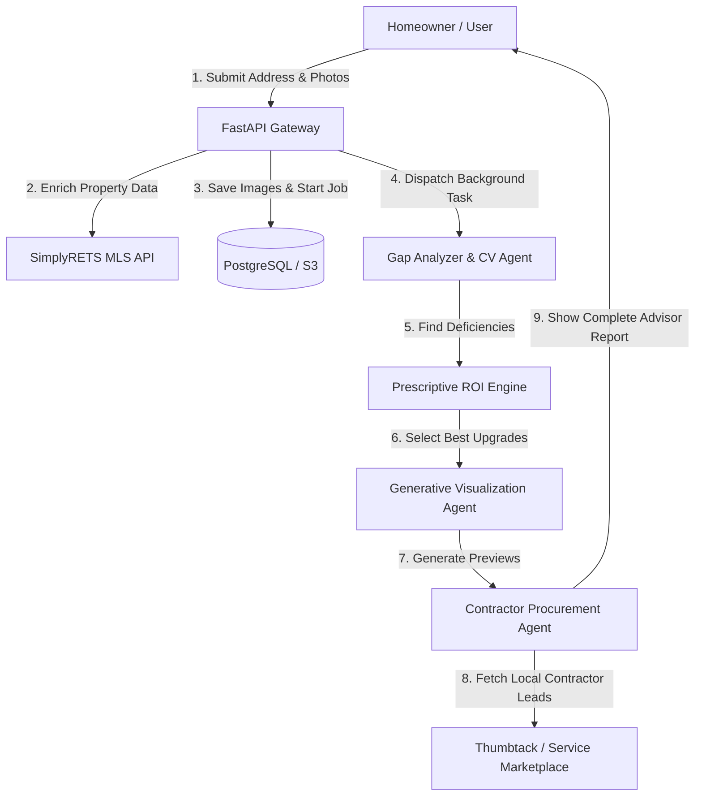

# HomeReady AI 🚀
### **AI-Powered Pre-Listing Home Upgrade Advisor**

HomeReady AI is a web-based, AI-powered advisor designed to help home sellers identify and execute the highest-ROI cosmetic and structural upgrades before listing their property. By uploading home photos and defining a budget, sellers receive an automated gap analysis against local comparables, photorealistic before/after room design previews, a ranked ROI upgrade advisor list, and matches to local vetted contractors to do the work.

---

## 🏗️ System Architecture & Workflow

The platform functions as a **Unified Value Optimization Engine** orchestrating a multi-agent workflow:



1. **Authentication & Ingestion:** The user registers or signs in securely (FastAPI Session/NextAuth) and inputs their address and current home photos.
2. **MLS Property Enrichment:** The backend queries the **SimplyRETS Web API** (RESO standard) using basic authentication to fetch bed/bath count, lot size, construction year, and area metrics.
3. **AI Gap Diagnostic:** The Computer Vision pipeline (powered by Google Gemini / Vertex AI models) reviews room images to flag defects, aging paint, outdated hardware, and landscaping deficiencies.
4. **Prescriptive ROI Selection:** A budget-constrained recommendation engine maps the defects against hyper-local market pricing to determine high-yield upgrades fitting strictly under the user's limit.
5. **Generative Visualizations:** An image diffusion model generates photorealistic before/after comparisons of the proposed upgrades.
6. **Execution Pipeline:** HomeReady matches the user with vetted local contractors, sending structured leads to Thumbtack to retrieve service quotes.

---

## 🛠️ Technology Stack

### **Frontend**
* **Core Framework:** Next.js 15 (App Router) & React 19 (TypeScript)
* **Styling:** TailwindCSS 3.4
* **State Management:** Zustand (lightweight client state) & TanStack React Query v5 (server-state synchronization)
* **Authentication:** NextAuth.js
* **Validation:** Zod schemas

### **Backend**
* **Core API Framework:** FastAPI (Python 3.12)
* **Task Queue & Broker:** Celery & Redis 7.2 (handling heavy generative processing asynchronously)
* **Database & ORM:** PostgreSQL 16 (with `pgvector` extension for semantic embedding lookups) & SQLAlchemy
* **AI & Computer Vision:** Google Cloud AI Platform (Vertex AI / Gemini API integration)
* **Dependencies Manager:** Poetry

---

## 🚀 Getting Started

### **Prerequisites**
* [Docker Desktop](https://www.docker.com/products/docker-desktop/)
* [Python 3.12](https://www.python.org/downloads/)
* [Node.js v20+](https://nodejs.org/)
* [Poetry](https://python-poetry.org/)

### **1. Spin Up Data Infrastructure**
In the root directory, start the PostgreSQL database (pre-bundled with `pgvector`) and Redis services:
```bash
docker-compose up -d
```
*Note: Databases and cache servers are secured to listen exclusively on `127.0.0.1` for local safety.*

### **2. Setup and Run the Backend API**
1. Navigate to the `backend` folder:
   ```bash
   cd backend
   ```
2. Install Python dependencies using Poetry:
   ```bash
   poetry install
   ```
3. Run migrations to initialize the database:
   ```bash
   # Schema migrations are automatically run on docker-compose init, or you can manually execute script tasks
   ```
4. Start the FastAPI server locally:
   ```bash
   poetry run uvicorn app.main:app --reload --host 127.0.0.1 --port 8000
   ```

### **3. Setup and Run the Frontend Client**
1. Navigate to the `frontend` folder:
   ```bash
   cd ../frontend
   ```
2. Install npm packages:
   ```bash
   npm install
   ```
3. Run the Next.js local development server:
   ```bash
   npm run dev
   ```
4. Open [http://localhost:3000](http://localhost:3000) in your browser.

---

## 🛡️ Security Implementations

* **Strict CORS Controls:** Configured in `backend/app/main.py` to only allow specific web origins (no wildcards allowed in production).
* **Secure HTTP Headers:** Uses middleware to set:
  * `Content-Security-Policy` (CSP)
  * `X-Content-Type-Options: nosniff`
  * `X-Frame-Options: DENY` (Clickjacking protection)
  * `Permissions-Policy` to disable unused hardware capabilities (camera, microphone, location)
* **Bcrypt Credentials Hashing:** User passwords are encrypted with memory-hard bcrypt algorithms inside `backend/app/core/security.py`.
* **API Rate Limiting:** Rate limit constraints are applied per-route based on IP/User session token headers to prevent service denial attacks.
* **Safe Localhost Bindings:** Internal backend servers and database Docker ports listen exclusively on `127.0.0.1` to avoid external port exposure.

---

## 🔌 API Endpoints Summary

| Endpoint | Method | Authentication | Description |
| :--- | :--- | :--- | :--- |
| `/api/v1/auth/signup` | `POST` | None | Registers a new homeowner account |
| `/api/v1/auth/login` | `POST` | None | Authenticates credentials and returns a JWT access token |
| `/api/v1/upload` | `POST` | Bearer Token | Ingests home images, performs magic bytes validation, and starts asynchronous background analysis |
| `/api/v1/analyze/{analysis_id}` | `GET` | Bearer Token | Polls background processing job status and retrieves analysis & report URL |
| `/api/v1/recommendations/{analysis_id}`| `GET` | Bearer Token | Fetches the raw sorted ROI recommendations list |
| `/api/v1/contractors/quote-requests` | `POST` | Bearer Token | Routes project leads to matched local contractors (Thumbtack integration) |

---

## 📁 Directory Structure

```text
Real-Estate-AI/
├── backend/
│   ├── app/
│   │   ├── api/          # Endpoints and webhook routing handlers
│   │   ├── core/         # JWT keys, rate limiting config, security settings
│   │   ├── schemas/      # Pydantic request & response payloads
│   │   ├── services/     # CV analyzing, storage validations, report & ROI logic
│   │   └── main.py       # FastAPI application initializations and CORS setups
│   ├── migrations/       # SQL migrations
│   └── pyproject.toml    # Python poetry package dependencies
├── frontend/
│   ├── src/
│   │   ├── app/          # Next.js Pages (analyze, dashboard, reports, settings)
│   │   ├── components/   # Shared UI components (Button, Modal, Toast, Table)
│   │   └── lib/          # Validation schemas, utility functions, auth handlers
│   └── package.json      # Node package requirements
├── docker-compose.yml    # PostgreSQL with pgvector & Redis configuration
└── README.md             # This document
```
