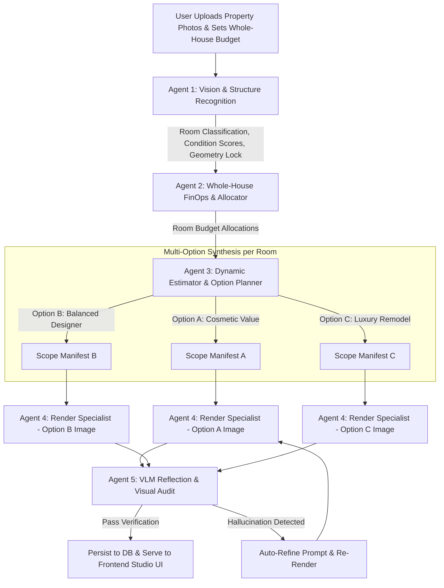

# HomeReady AI: Agentic Multi-Agent Pipeline & UI Evolution Plan

This document provides a comprehensive root-cause analysis of current system gaps, a hardening strategy for autonomous AI-driven renovation planning, and two production-ready prompts to revamp both the backend AI pipeline and frontend UI/navigation.

---

## 1. Executive Summary & Root-Cause Analysis

### Why does the current app only add "one change" and use hardcoded lists?
An inspection of the codebase (`finops_budget_agent.py` and `multi_agent_pipeline.py`) reveals four core architectural bottlenecks:

1. **Static If/Else Scope Itemization**:
   - Currently, `build_room_scope()` in `finops_budget_agent.py` uses hardcoded if/else statements (`if room_budget >= 6000: items = [...] elif room_budget >= 3500: items = [...]`).
   - Instead of dynamically prompting an LLM to inspect the actual room conditions and propose custom upgrade paths, it outputs a static list of 4 predefined strings for "Kitchen", "Bathroom", "Bedroom", or "Living Room".
2. **Single-Render Image Duplication**:
   - In `multi_agent_pipeline.py` (lines 700–703), the recommendation dictionary sets:
     ```python
     "tier_5k_url": master_render_url,
     "tier_10k_url": master_render_url,
     "tier_15k_url": master_render_url,
     ```
   - The pipeline generates only **one** image (`house_allocated_tier`) and clones its URL across all budget tiers. Consequently, users never see alternative design options or tiered budgets.
3. **Arbitrary Percentage Pricing**:
   - Instead of pricing items using real-world labor, material quantities, or regional pricing indexes, cost is calculated as a fixed percentage of the allocated room budget (`round(room_budget * weight, 2)`).
4. **No Closed-Loop Visual Verification**:
   - After generating an image, there is no VLM critique loop to verify whether the AI renderer actually added the specified upgrades or if it hallucinated elements (e.g., adding a kitchen island to a bathroom or covering a window).

---

## 2. Comprehensive Gap Analysis

| Layer | Current Implementation | Architectural Gap | Target Agentic Solution |
| :--- | :--- | :--- | :--- |
| **1. Vision & Structure Recognition** | Basic VLM prompt (`p2_prompt`) returning a flat JSON with simple booleans (`detected_cabinets`, `has_sink_or_faucet`). | No multi-photo spatial clustering, no condition scoring (1–10), and no architectural constraint detection (ceiling height, window clearance). | **Vision & Geometry Agent**: Multi-image room clustering, structural feature bounding, condition scoring (flooring, cabinetry, walls), and strict layout/furniture preservation locking. |
| **2. Budget Allocation & Multi-Option Planning** | Static ROI weight table (`48% kitchen, 26% bath`) with rooms under `$2,500` dropped. Single static scope per room. | Fails to generate multiple design tiers or alternative renovation strategies within the whole-house budget ceiling. | **Whole-House FinOps & Planner Agent**: Allocates whole-house budget cap across rooms and generates **3 distinct options per room** (*Option A: Value Cosmetic Refresh*, *Option B: Balanced Designer Upgrade*, *Option C: Luxury Remodel*). |
| **3. Pricing & Itemization** | Fixed math multipliers (`cost = budget * 0.38`). No material specs or labor split. | Not agentic or market-realistic. Cannot reconcile individual line items with local contractor pricing. | **Dynamic Estimator Agent**: AI-driven itemization with realistic labor/material breakdowns, regional cost indexes, and guaranteed reconciliation to the room's allocated share. |
| **4. AI Image Generation** | Single image generated per room via `gemini-3.1-flash-image`. URL cloned across all tiers. | Only one visual outcome per room; ignores Option A/B/C variations. | **Multi-Option Render Agent**: Generates distinct before/after image-to-image renders for each option (Option A, B, C) using Canny edge wireframes and prompt-token binding. |
| **5. Quality & Hallucination Audit** | Basic post-render audit stub without automated retry or prompt refinement. | Visual hallucinations (e.g., covered windows, missing items) reach the user. | **VLM Reflection & Audit Agent**: Closed-loop verification comparing the generated image against the itemized manifest. Automatically rejects and re-prompts on hallucination. |
| **6. UI & Navigation** | Rigid sidebar rail, cluttered top navbar, and static recommendation cards without multi-option tab switching. | Lacks premium visual polish, dynamic interactive budget exploration, and Option A/B/C tab navigation. | **Modern AI Studio UI**: Sleek glassmorphic navigation, interactive Option A/B/C switcher per room, before/after slider, and real-time whole-house budget dial. |

---

## 3. Target Multi-Agent Pipeline Architecture



---

## 4. How to Harden the AI Agents

> [!IMPORTANT]
> **Key Hardening Principle: Prompt-Token Binding & Closed-Loop Reflection**
> To ensure that the generated image accurately reflects the itemized list, every item in the upgrade manifest must carry a specific **visual prompt token** that is injected into the renderer.

1. **Multi-Photo Structural Recognition (Agent 1)**:
   - **Enforce JSON Schema**: Use structured outputs to classify `room_type`, `condition_score` (1–10), `window_locations`, and `preserved_furniture_ids`.
   - **Canny Geometry Locking**: Always pass the Canny edge map and explicitly forbid altering camera angle, perspective, or structural walls.
2. **Whole-House Budget Cap & 3-Option Generation (Agents 2 & 3)**:
   - **Budget Lock**: The sum of all room allocations must strictly equal the user's whole-house budget ceiling.
   - **Option Diversity**: For *every* analyzed room, the agent must generate three distinct options:
     - **Option A (Cosmetic Refresh)**: Surface painting, hardware swap, modern lighting (~40% of room ceiling).
     - **Option B (Balanced Upgrade)**: Cabinet refacing, quartz surfaces, updated plumbing/lighting (~75% of room ceiling).
     - **Option C (Full Remodel)**: Custom cabinetry, architectural built-ins, premium flooring (100% of room ceiling).
3. **Closed-Loop Visual Audit & Self-Correction (Agent 5)**:
   - Implement a reflection loop: After Agent 4 renders an image, Agent 5 (Gemini VLM) inspects the image with the prompt: *"Check if the following items appear in the image: [list]. Check if any window is blocked or if furniture was deleted. Return `pass: true/false` and `critique`."*
   - If `pass: false`, the pipeline automatically appends the critique to the negative prompt and retries once.

---

## 5. UI & Navigation Evolution Plan

> [!TIP]
> **UX Focus: Interactive Exploration over Static Cards**
> The revamped UI transitions from a static feed of cards to an **interactive Architectural Studio** where users can switch between Option A, B, and C for every room while watching the whole-house budget dynamically recalculate.

### UI Revamp Highlights:
- **Clean Sidebar / Header Navigation**: Replace the chunky sidebar rail with a minimalist glassmorphic navigation bar featuring clear badges for active property sessions.
- **Room-by-Room Option Switcher (Option A / B / C)**:
  - Each room features an interactive tab switcher: `[ Option A: Value ]` | `[ Option B: Balanced ]` | `[ Option C: Luxury ]`.
  - Selecting an option instantly updates the Before/After slider, the itemized cost breakdown, and the projected ROI for that room.
- **Interactive Whole-House Budget Dial**:
  - A responsive budget slider at the top of the screen allows users to adjust their total house budget ceiling ($5k–$100k) and instantly see proportionally scaled recommendations.
- **Interactive Before / After Image Slider**:
  - Drag-to-compare slider with zoom capability and toggles to view the Canny structural edge map.

---

## 6. Detailed Prompt 1: Revamp the Backend AI Multi-Agent Pipeline

Copy and paste the following prompt into an AI agent to revamp the backend architecture:

```markdown
# TASK: Revamp HomeReady AI Backend into an Autonomous Multi-Option Multi-Agent Pipeline

You are an expert Principal AI Architect and Python Developer. Your objective is to revamp the backend renovation pipeline in `backend/app/services/multi_agent_pipeline.py` and `backend/app/services/agents/` so that it operates as a truly agentic, multi-option, highly accurate renovation studio.

## Critical Technical Requirements:

### 1. Hardened Room Recognition & Geometry Locking (Agent 1 - `vision_perception_agent.py`)
- Upgrade the vision scan to use Gemini structured JSON outputs.
- Identify:
  - `room_type` (Kitchen, Primary Bathroom, Secondary Bathroom, Living Room, Bedroom, Home Office, Laundry Room).
  - `condition_score` (1-10 for cabinetry, flooring, surfaces, and lighting).
  - `preserved_furniture`: Specific furniture pieces that must remain locked.
  - `window_locations`: Boolean flag and descriptions to ensure windows remain 100% clear.
- Continue generating high-contrast Canny edge wireframes (`_canny.png`) to preserve room perspective and geometry.

### 2. Whole-House Budget Cap & 3-Tier Option Generation (Agents 2 & 3 - `finops_budget_agent.py`)
- REPLACE all hardcoded `if is_bedroom: if room_budget >= ...` static lists with a dynamic LLM/Agent call that generates **three distinct design & budget options per room** within the room's share of the whole-house budget:
  - **Option A (Cosmetic Value Refresh)**: High-ROI surface updates, designer paint, lighting, and hardware (~40% of room allocation).
  - **Option B (Balanced Designer Upgrade)**: Refaced cabinetry, engineered quartz/stone surfaces, and updated fixtures (~75% of room allocation).
  - **Option C (Luxury Architectural Remodel)**: Custom cabinetry, architectural built-ins, and premium finishes (100% of room allocation).
- Ensure the sum of Option B (or selected options) across all rooms strictly reconciles with the user's whole-house budget ceiling.
- Each option MUST include an itemized list of 4-6 upgrades where each item has:
  - `feature_name`
  - `item_cost` (market-realistic labor/material pricing)
  - `added_details`
  - `visual_prompt_token` (exact descriptive terms for image rendering)

### 3. Multi-Option Image Synthesis (Agent 4 - `controlnet_render_agent.py`)
- DO NOT clone the same image URL across `tier_5k_url`, `tier_10k_url`, and `tier_15k_url`.
- For each room, execute distinct image-to-image render calls for **Option A**, **Option B**, and **Option C**, injecting the specific `visual_prompt_token` list for that option.
- Enforce strict negative prompts to prevent hallucinations: no moving windows, no blocking natural light, no replacing dining tables with cabinets, and no adding plumbing to dry rooms.

### 4. Closed-Loop VLM Visual Audit (Agent 5 - `quality_audit_agent.py`)
- Implement an automated reflection step after each image is rendered:
  - Send the generated before/after image pair and the option's itemized manifest to Gemini VLM.
  - Ask: *"Does the after image accurately show [items]? Are any windows blocked or furniture deleted? Return JSON `{'passed': bool, 'critique': str}`."*
  - If `'passed'` is False, automatically re-prompt the image generator once with the critique appended to the prompt.

### 5. Database & Schema Compatibility
- Update the recommendation storage dictionary so that `options` (an array containing Option A, Option B, and Option C with their respective image URLs, costs, ROI, and scopes) is persisted cleanly in `why_details` or an extended JSON column, fully backward-compatible with the frontend API.
```

---

## 7. Detailed Prompt 2: Revamp the Frontend UI, UX & Navigation

Copy and paste the following prompt into an AI agent to revamp the frontend UI and navigation:

```markdown
# TASK: Evolve HomeReady AI Frontend into a Stunning, Premium Architectural Studio UI

You are a Principal Lead Frontend UX Architect and Next.js/TailwindCSS Expert. Your objective is to revamp `frontend/src/app/page.tsx`, `frontend/src/app/analyze/[id]/page.tsx`, and `frontend/src/components/layout/AppLayout.tsx` to transform the application from a basic card feed into an interactive, premium AI Architectural Studio.

## Critical Design & UX Requirements:

### 1. Premium Aesthetic & Navigation Evolution (`AppLayout.tsx`)
- Replace the cluttered sidebar rail with a minimalist, glassmorphic header navigation bar and an expandable studio workspace drawer.
- Implement a curated HSL color palette (Sleek Dark Mode / Warm Architectural Charcoal & Slate with vibrant Accents).
- Ensure typography uses modern sans/serif contrasts (e.g., serif headings for architectural elegance, clean sans-serif for financial data).
- Add micro-animations (smooth hover states, page transition fades, badge pulses).

### 2. Interactive Room Studio & Option A/B/C Switcher (`analyze/[id]/page.tsx`)
- For each room analyzed by the backend, render an interactive **Room Studio Card**:
  - Header with Room Name, Detected Condition Score badge, and Allocated Budget Share.
  - **Option Switcher Tabs**: Three clearly styled toggle buttons:
    - `[ Option A: Cosmetic Refresh ($X) ]`
    - `[ Option B: Balanced Designer ($Y) ]`
    - `[ Option C: Luxury Remodel ($Z) ]`
  - Clicking an option tab dynamically updates:
    - The Before/After Image Comparison Slider to show *that specific option's rendered image*.
    - The itemized cost manifest with individual checkboxes.
    - The ROI and projected value uplift metrics for that specific option.

### 3. Interactive Whole-House Budget Ceiling Dial
- Add a sticky or prominent **Whole-House Budget Control** at the top of the results page.
- Slider range: `$5,000` to `$100,000` (defaulting to the backend analyzed ceiling).
- As the user drags the slider, proportionally recalculate each room's budget allocation in real time and highlight which Option (A, B, or C) best fits the adjusted budget.

### 4. Interactive Before / After Comparison Slider
- Replace side-by-side static images with a smooth, drag-to-compare slider component.
- Include control buttons on the image canvas:
  - `[ View Before ]` | `[ View After ]` | `[ Structural Canny Edge Wireframe ]`
  - A toggle to zoom in on specific architectural details.

### 5. Exportable Whole-House Remodel Summary & Scope Checklist
- Include a floating or footer summary bar showing:
  - **Total House Budget vs. Selected Options Cost**
  - **Combined Projected Property Value Uplift**
  - **Total Estimated ROI %**
- Provide a `[ Generate Contractor Bid Package ]` action button that compiles all selected Option scopes into a formatted checklist.
```
