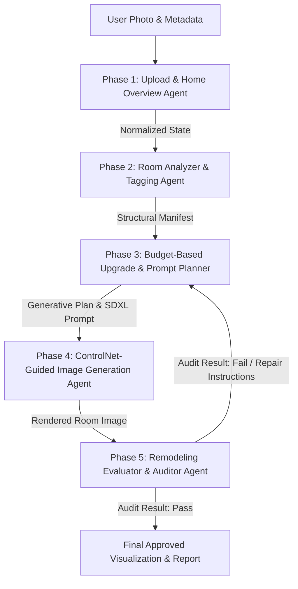

# HomeReady: Multi-Agent Architecture Design

## 1. Core Problem Overview and Solution

The primary failure of existing text-to-image models in room renovation and interior redesign stems from a **lack of visual and spatial consistency**. Standard diffusion models treat input images as soft prompts or style references, frequently ignoring underlying room geometry. This leads to hallucinated architectural elements—such as shifting window placements, altered wall dimensions, misplaced load-bearing structures, or impossible spatial layouts—creating a severe disconnect between a homeowner's real-world property and the generated remodeling proposals.

To solve this, HomeReady implements a **multi-agent, skill-driven architecture**. Rather than relying on a single monolithic model to simultaneously interpret, budget, design, and render, the system decomposes the workflow into specialized, single-responsibility agents managed by a central supervisor. These agents collaborate to extract spatial manifests, plan budget-bounded upgrades, enforce geometric boundaries via **ControlNet (Depth & Canny)**, and validate visual outputs through a **closed-loop audit and repair mechanism**.

---

## 2. Detailed Multi-Agent Workflow

The system employs a **Supervisor Pattern** orchestrating five distinct phases with stateful transitions and conditional repair loops.



### Phase 1: Upload & Home Overview Agent
* **Objective:** Ingest raw room images and user metadata (location, budget limit, target aesthetic, room type context).
* **Responsibilities:**
  - Validates image resolution, lighting quality, and format suitability.
  - Normalizes user metadata and initializes the central project workflow state.
  - Generates initial depth maps and edge masks (Canny) to serve as structural baselines.

### Phase 2: Room Analyzer & Tagging Agent
* **Objective:** Perform architectural decomposition using Vision-Language Models (VLMs).
* **Responsibilities:**
  - Extracts structural features (fixed walls, windows, doors, structural columns, ceiling boundaries).
  - Tags current materials, finishes, lighting fixtures, and furniture layout.
  - Produces a deterministic `Structural Manifest` JSON specifying bounding zones and spatial tags.

### Phase 3: Budget-Based Upgrade & Prompt Planner Agent
* **Objective:** Map user financial constraints to viable, high-ROI material upgrades and design generative prompts.
* **Responsibilities:**
  - Evaluates budget tier rules (e.g., $10k cosmetic focus vs. $15k+ material/fixture overhaul).
  - Selects specific material upgrades (e.g., replace laminate with quartz countertops, re-paint cabinets, update hardware).
  - Formulates a highly specific Stable Diffusion XL prompt while embedding strict layout retention constraints.

### Phase 4: ControlNet-Guided Image Generation Agent
* **Objective:** Synthesize photorealistic images that strictly preserve the input photo's spatial geometry.
* **Responsibilities:**
  - Feeds original depth maps into ControlNet Depth to maintain spatial perspective and 3D layout.
  - Applies ControlNet Canny/Lineart to lock architectural edges (window frames, wall/floor junctions).
  - Applies optional Reference ControlNet or LoRA modules to maintain material/style consistency across multi-angle renderings.

### Phase 5: Remodeling Evaluator & Auditor Agent
* **Objective:** Provide automated quality assurance through closed-loop feedback.
* **Responsibilities:**
  - Compares the rendered output against the original image and Phase 2 `Structural Manifest`.
  - Checks for spatial drift (e.g., missing windows, altered wall positions, unrequested structural changes).
  - Issues a `Pass` signal to publish the report, or a `Fail` signal with detailed `Repair Instructions` to re-trigger Phase 3/4 generation.

---

## 3. System Prompt Templates

### Phase 2: Room Analyzer Prompt
```text
Role: Senior Architectural Vision Specialist.
Task: Analyze the uploaded room image and create a structural manifest.

Inputs:
- raw_image_data: [IMAGE_BINARY / BASE64]
- room_context: { "declared_room_type": string }

Instructions:
1. Examine the image carefully to extract spatial boundaries, architectural elements, and surface materials.
2. Distinguish permanent structural fixtures (walls, windows, doors, load-bearing pillars) from replaceable cosmetic elements (furniture, paint, hardware, lighting).
3. Output strictly valid JSON matching the schema below without conversational filler.

Output Schema:
{
  "room_type": "string",
  "structural_elements": ["walls", "windows", "doors"],
  "current_materials": {
    "floor": "string",
    "countertops": "string",
    "cabinets": "string",
    "walls": "string"
  },
  "spatial_layout_tags": ["list_of_tags"],
  "fixed_geometry_zones": ["list_of_zones"]
}
```

### Phase 3: Budget Planner Prompt
```text
Role: Professional Renovation Planner.
Task: Map the user budget to specific material upgrades and synthesize a ControlNet-ready image generation prompt.

Budget Mapping Rules:
- Tier 1 ($10,000): Focus on cosmetic enhancements only (paint refresh, backsplash tile update, cabinet hardware replacement, minor lighting fixture updates).
- Tier 2 ($15,000): Include Tier 1 upgrades PLUS premium material updates (e.g., quartz/granite countertops, cabinet refinishing/facing, high-end lighting overhaul, flooring replacement).
- Tier 3 ($25,000+): Include Tier 2 upgrades PLUS custom cabinetry, tile re-surfacing, and premium appliance integrations.

Inputs:
- budget: number
- structural_manifest: JSON (from Phase 2)
- target_style: string (e.g., "Modern Organic", "Transitional", "Nordic Minimalist")

Instructions:
1. Determine the appropriate budget tier based on user input.
2. Select target upgrades matching the budget constraint while leaving structural elements strictly untouched.
3. Construct a positive prompt for SDXL emphasizing realistic materials, professional lighting, and precise interior design details.
4. Output a JSON payload with selected upgrades and generative prompts.

Output Schema:
{
  "selected_tier": "string",
  "planned_upgrades": [
    { "category": "string", "item": "string", "estimated_cost": number }
  ],
  "sdxl_positive_prompt": "string",
  "sdxl_negative_prompt": "string",
  "layout_preservation_rules": ["string"]
}
```

### Phase 5: Remodeling Evaluator (Auditor) Prompt
```text
Role: Quality Assurance Consistency Agent.
Task: Audit the generated room image against the original photo and structural manifest.

Inputs:
- original_image: [IMAGE]
- generated_image: [IMAGE]
- structural_manifest: JSON (from Phase 2)
- planned_upgrades: JSON (from Phase 3)

Instructions:
1. Compare the generated image to the original image and structural manifest.
2. Check for structural drift:
   - Are windows, doors, and walls in the exact same positions?
   - Did the model hallucinate impossible architectural features or alter room dimensions?
3. Verify upgrade compliance:
   - Were the requested budget upgrades applied correctly?
4. Return a status of "PASS" if consistent, or "FAIL" with actionable repair instructions.

Output Schema:
{
  "status": "PASS | FAIL",
  "confidence_score": number,
  "detected_discrepancies": ["string"],
  "repair_instructions": "string"
}
```

---

## 4. Technical Architecture Recommendations

| Component | Technology Recommendation | Rationale |
| :--- | :--- | :--- |
| **Orchestration** | **LangGraph** (StateGraph) | Provides stateful, multi-turn execution, cycle detection, and structured state transitions for multi-agent workflows. |
| **Visual Analysis** | **Gemini 1.5 Pro / GPT-4o** | High-capacity multi-modal models for architectural feature extraction and structured JSON output. |
| **Image Synthesis** | **Stable Diffusion XL (SDXL)** | High-resolution base model optimized for architectural photorealism and fine-grained visual control. |
| **Spatial Control** | **ControlNet (Depth & Canny)** | Preserves 3D depth maps and 2D edge contours from original photos, preventing wall and window hallucination. |
| **Style Consistency** | **LoRA & Reference ControlNet** | Maintains unified color palettes, material textures, and design aesthetics across multiple room angles. |
| **Audit & Repair** | **Closed-Loop Feedback State Machine** | Automates discrepancy detection between input constraints and visual output, triggering iterative regeneration. |

---

## 5. Implementation Blueprint (LangGraph Integration)

```python
from typing import TypedDict, List, Dict, Any, Optional
from langgraph.graph import StateGraph, END

class HomeReadyState(TypedDict):
    raw_image_url: str
    user_budget: float
    target_style: str
    depth_map_url: Optional[str]
    canny_map_url: Optional[str]
    structural_manifest: Optional[Dict[str, Any]]
    renovation_plan: Optional[Dict[str, Any]]
    generated_image_url: Optional[str]
    audit_result: Optional[Dict[str, Any]]
    retry_count: int

# Define Workflow Nodes
def upload_overview_agent(state: HomeReadyState) -> HomeReadyState:
    # Phase 1: Pre-process image, compute depth/canny maps
    return state

def room_analyzer_agent(state: HomeReadyState) -> HomeReadyState:
    # Phase 2: Execute VLM structural tagging
    return state

def budget_planner_agent(state: HomeReadyState) -> HomeReadyState:
    # Phase 3: Create budget-bounded renovation plan and SDXL prompt
    return state

def controlnet_generator_agent(state: HomeReadyState) -> HomeReadyState:
    # Phase 4: Run SDXL + ControlNet Depth/Canny generation pipeline
    return state

def remodeling_evaluator_agent(state: HomeReadyState) -> HomeReadyState:
    # Phase 5: Perform VLM multi-modal audit
    return state

def evaluate_audit_decision(state: HomeReadyState) -> str:
    audit = state.get("audit_result", {})
    if audit.get("status") == "PASS" or state.get("retry_count", 0) >= 3:
        return "approved"
    return "repair_required"

# Build LangGraph Workflow
workflow = StateGraph(HomeReadyState)
workflow.add_node("upload_overview", upload_overview_agent)
workflow.add_node("room_analyzer", room_analyzer_agent)
workflow.add_node("budget_planner", budget_planner_agent)
workflow.add_node("controlnet_generator", controlnet_generator_agent)
workflow.add_node("remodeling_evaluator", remodeling_evaluator_agent)

workflow.set_entry_point("upload_overview")
workflow.add_edge("upload_overview", "room_analyzer")
workflow.add_edge("room_analyzer", "budget_planner")
workflow.add_edge("budget_planner", "controlnet_generator")
workflow.add_edge("controlnet_generator", "remodeling_evaluator")

workflow.add_conditional_edges(
    "remodeling_evaluator",
    evaluate_audit_decision,
    {
        "approved": END,
        "repair_required": "budget_planner"
    }
)

app = workflow.compile()
```

---

## Document Information

* **Project Lead:** HomeReady Architecture & Engineering Team
* **Review Date:** July 23, 2026
* **Reference Docs:** 
  - [HomeReady AI - Product Requirements Document.md](file:///Users/maheshgoyal/Documents/Real-Estate-AI/HomeReady%20AI%20-%20Product%20Requirements%20Document.md)
  - [README.md](file:///Users/maheshgoyal/Documents/Real-Estate-AI/README.md)
